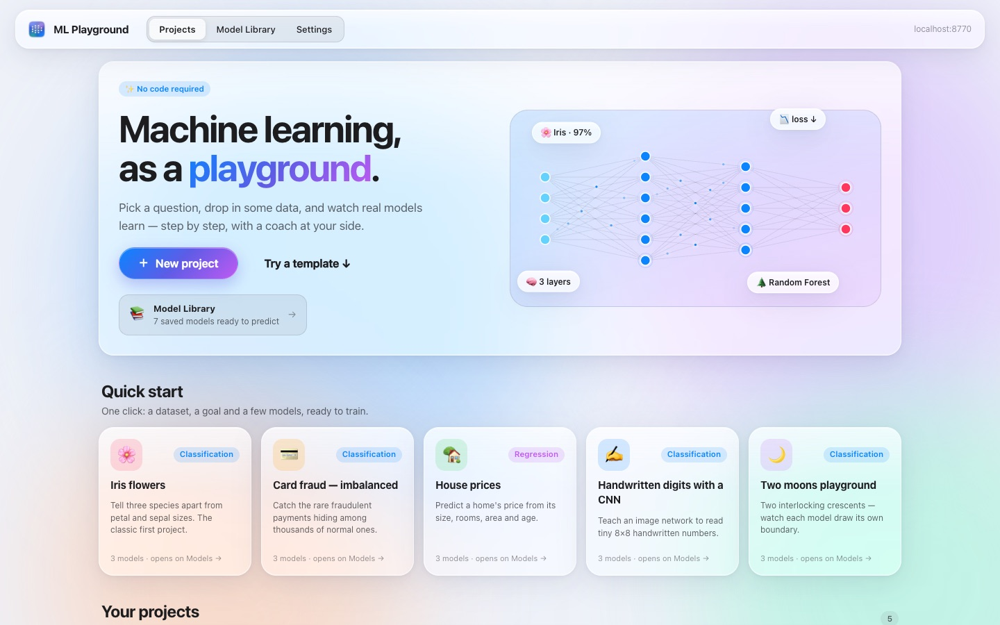
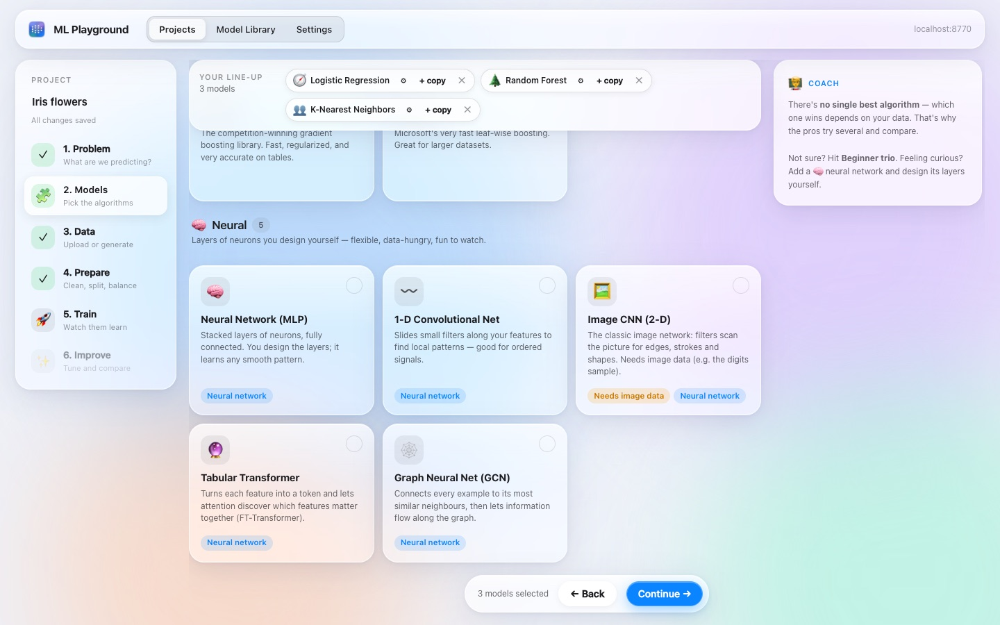
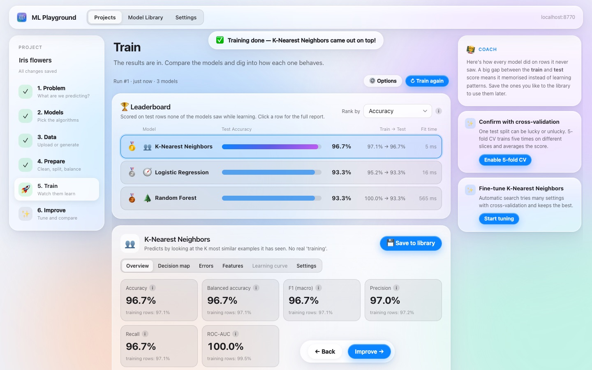
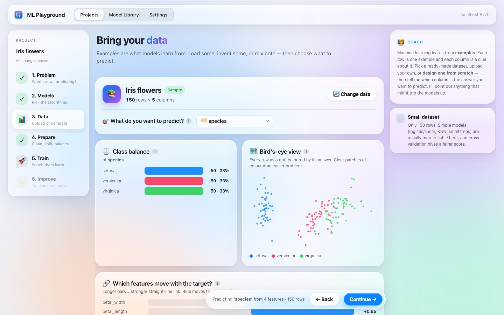
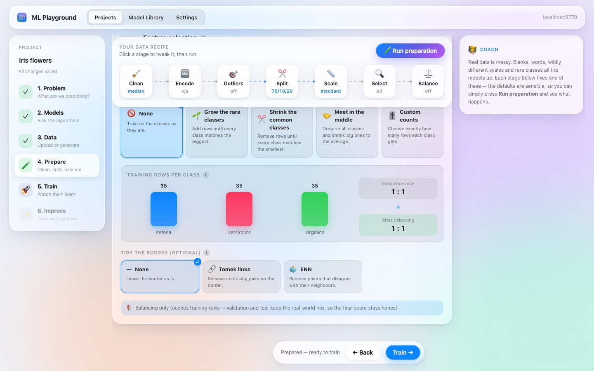
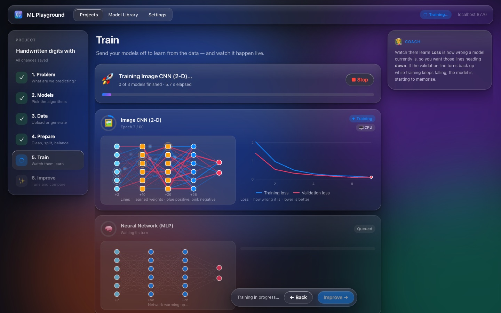
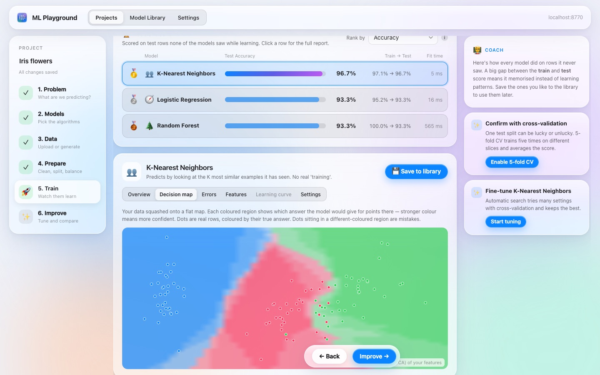
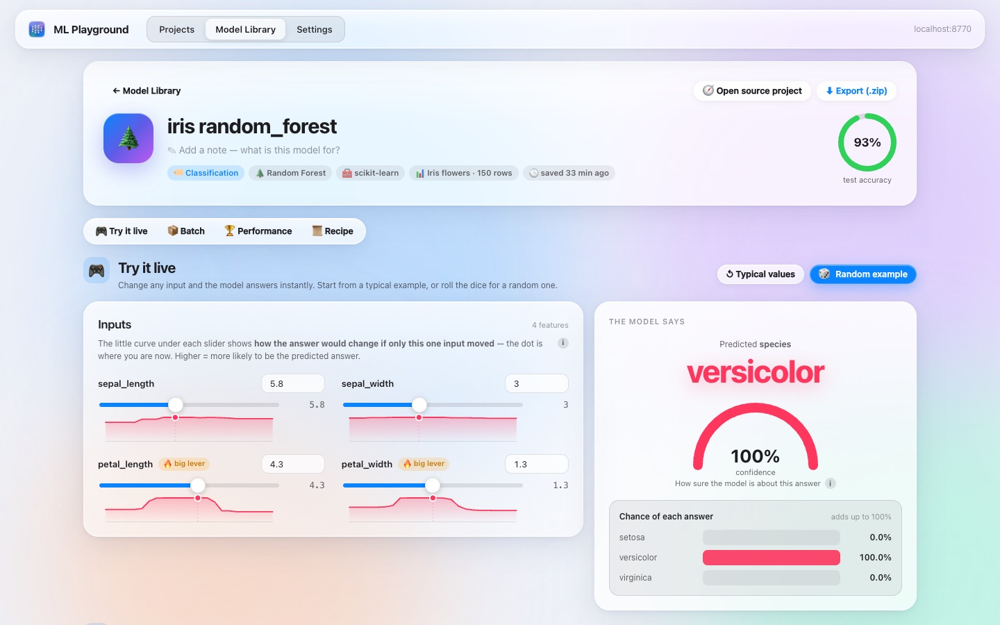
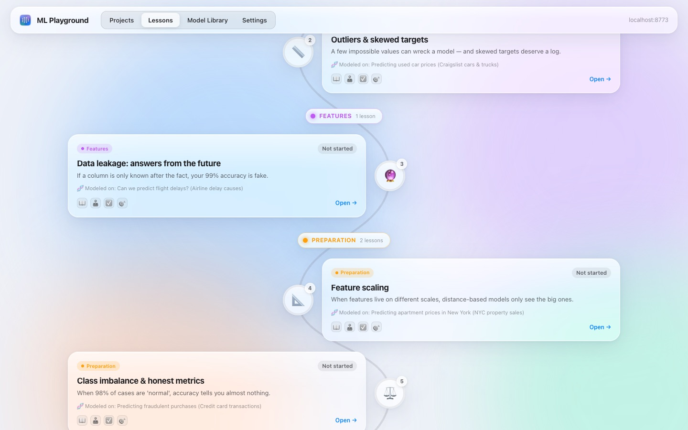
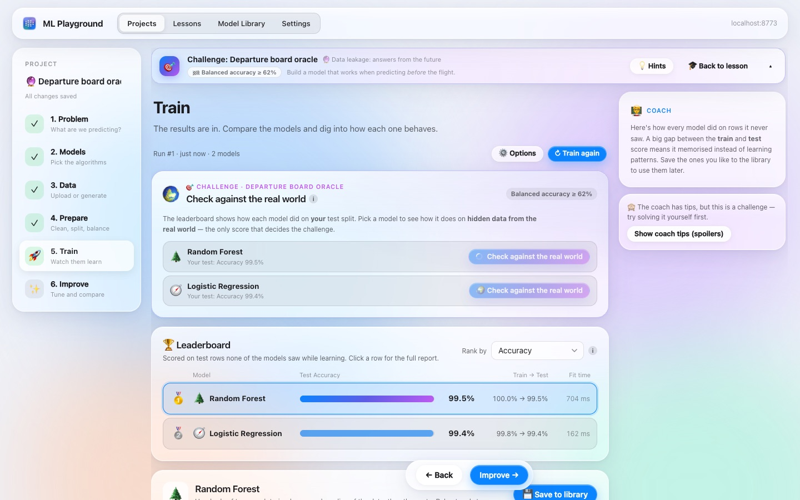

# MLSimulator — ML Playground

**Machine learning as a playground.** A local, no-code app that walks you through building real machine-learning
models with PyTorch and scikit-learn: choose a problem, pick models, bring or invent data, clean it, train, and
improve. Everything is visual, animated and explained in plain language, and a coach points out what to fix next.

It runs entirely on your computer. Nothing is uploaded anywhere.



## What you can do

| | |
|---|---|
| **Guided wizard.** Problem → Models → Data → Prepare → Train → Improve, with a coach that explains every step and suggests one-click fixes. |  |
| **Models.** 17 classic models (linear/logistic, ridge, lasso, SVM, KNN, naive Bayes, trees, random forest, extra trees, gradient boosting, histogram boosting, AdaBoost, XGBoost, LightGBM). Neural networks you design visually: MLP, 1-D CNN, image CNN, tabular Transformer, graph neural network. Train many models at once and compare them. |  |
| **Data.** Built-in sample datasets, CSV / JSON / Excel upload, a synthetic-data designer (pick a distribution per feature and a rule for the target, with live histograms), classic toy shapes (moons, spirals…), or a mix of uploaded and synthetic data. |  |
| **Data engineering.** Missing values, encoding, outliers, feature engineering (date parts, ratios, products, buckets, formulas), duplicates, honest splits (random, by group, by time), scaling, feature selection, and class rebalancing (SMOTE, ADASYN, Borderline-SMOTE, NearMiss, Tomek links, ENN or exact class counts), each with a before/after animation. |  |
| **Training you can watch.** Live loss curves, network diagrams whose connections change colour as the weights learn, decision maps, confusion matrices, ROC curves, residuals, feature importance, mistakes, slices, calibration, cross-validation, and an automatic baseline to beat. |  |
| **Improve.** Automatic hyperparameter search, decision-threshold tuning, and the score history of every run. |  |
| **Model library.** Save models together with their full recipe. Try them live with sliders and what-if curves, predict on new files (and get scores if the file includes the true answers), or export them as .zip. |  |
| **Vision.** Image classification and image regression: built-in image sets (shapes, count the dots, line tilt, arrows, handwritten digits) or your own ZIP of images. Augmentation with previews, CNNs and a Tiny ResNet next to "pixels as a table" models, and a look inside the network: saliency maps, learned filters, feature maps and a mistakes gallery. Draw or upload a picture to test a saved model. |  |
| **Discover (unsupervised).** Clustering (k-means with a live animation, Gaussian mixtures, DBSCAN, hierarchical), maps of your data (PCA with scree and loadings, t-SNE) and anomaly detection (Isolation Forest, One-Class SVM, Local Outlier Factor). Cluster profiles explain each group, an optional hidden "truth" column shows whether the groups make sense, and a k sweep helps choose the number of clusters. |  |
| **Language (NLP).** Text classification from built-in sets (product reviews with negations, support tickets, SMS spam) or your own CSV: bag-of-words models (TF-IDF with words or word pairs) next to word embeddings, a GRU and a tiny Transformer. See the words that drive each class, word-by-word explanations of predictions, and type your own sentences in the playground. |  |
| **Lessons.** 17 interactive lessons in pipeline order. Each one teaches a classic pitfall, lets you play with it in a demo, quizzes you, then hands you a dataset with that problem baked in. Your model is graded on a hidden "real world" test set. |  |

### Lessons

Baselines · Missing values · Outliers & skewed targets · Data leakage · Feature engineering · Honest splits (groups &
time) · Feature scaling · Class imbalance · Overfitting · Calibration & error analysis · Spurious shortcuts · Fairness
& proxy bias · Choosing k · The curse of dimensionality · Bag of words · Convolutions · Data augmentation.



## Quick start

### macOS (recommended)
Requirements: Python 3.10+ (3.11 recommended) and Node.js 18+ (only needed once, to build the interface).
[`uv`](https://github.com/astral-sh/uv) makes setup faster but is optional.

```sh
git clone https://github.com/GilCaplan/MLSimulator.git
cd MLSimulator
zsh scripts/setup.sh
```

Setup creates a Python environment, builds the interface and installs an **ML Playground** app icon on your Desktop,
in `~/Applications` and in the project folder. Double-click it: the app starts on a free port (8765 by default) and
opens in your browser. Running it again simply reopens the same app.

### Linux / Windows (manual)
```sh
python3 -m venv .venv
.venv/bin/pip install -r requirements.txt          # Windows: .venv\Scripts\pip install -r requirements.txt
cd frontend && npm install && npm run build && cd ..
.venv/bin/python -m mlp.main --port 8765           # Windows: .venv\Scripts\python -m mlp.main --port 8765
```
Then open <http://localhost:8765>.

## Documentation
- **[User guide](docs/USER_GUIDE.md)**: every screen and setting explained.
- **[Tutorial](docs/TUTORIAL.md)**: your first models, step by step (about 20 minutes).
- **[Architecture](docs/ARCHITECTURE.md)**: how the app is built.
- **[Contributing](CONTRIBUTING.md)**: development setup and the workflow guides in [`docs/workflows/`](docs/workflows/)
  (adding models, datasets and lessons, releases).
- **[Roadmap](docs/expansion_plan.md)**: vision, unsupervised learning and NLP have landed; recommenders and forecasting are next.

## Where things are stored
Projects, datasets, trained models and logs live in `data/` inside the project folder. Back it up to keep your work;
delete it to start fresh. Settings → *Show in Finder* opens it.

## License
[PolyForm Noncommercial 1.0.0](LICENSE). You may use, copy and modify ML Playground for **personal, educational,
research, hobby and other non-commercial purposes**. **Commercial use is not permitted.** If you'd like to use it
commercially, open an issue to ask.

Copyright © 2026 Gil Caplan.
